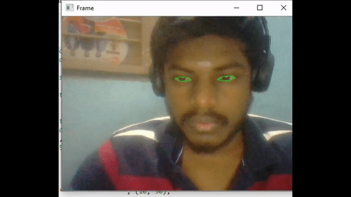

# Driver Drowsiness Detection

### Thirumurugan Ramar

 To detect and alert users,when their eyes is drowsy.This can be used by riders who tend to drive for a longer period of time that may lead to accidents.
        

#### Reference:
   Akshay Bahadur
